# MACH Race 2026 - MACH-ORCHESTRATOR

**Orquestador agéntico del ciclo ADLC (Análisis, Diseño, Desarrollo, Lanzamiento y Cierre)** para MACHBank Hackathon.

Sistema de IA multi-agente que automatiza el desarrollo de software desde el PRD hasta el código desplegable, con checkpoints de aprobación humana vía Slack, validación automática de builds, y creación de Pull Requests en GitHub.

---

## 🎯 ¿Qué hace este proyecto?

**MACH-ORCHESTRATOR** es un sistema de desarrollo de software automatizado que:

1. **Orquesta 7 agentes especializados** usando LangGraph para generar artefactos de desarrollo
2. **Implementa Human-in-the-Loop (HITL)** con checkpoints de aprobación vía Slack
3. **Genera código real** y crea Pull Requests en GitHub automáticamente
4. **Valida builds** con auto-sanación: detecta errores de compilación y los corrige iterativamente
5. **Integra con Jira** para tracking de tareas y sincronización de estado
6. **Expone un dashboard en tiempo real** (Vue.js) para monitorear el progreso del ciclo

---

## 🏗️ Arquitectura Frontend-Only

El proyecto genera **únicamente aplicaciones frontend** (Next.js, React, Vue.js) con **Mock-Driven Development**:

- ✅ **Frontend real**: Next.js 15 con App Router, TypeScript, TailwindCSS
- ✅ **APIs mockeadas**: Todas las llamadas backend se simulan con `Promise + setTimeout`
- ✅ **Build validation**: Valida que el código compile (`npm run build`) antes del PR
- ✅ **Auto-sanación**: Si el build falla, el agente recibe el error y regenera el código

---

## 🤖 Agentes del Ciclo ADLC

| Fase | Agente | Entregable | LLM por Defecto |
|------|--------|------------|-----------------|
| **PRD** | Product Manager | `PRDSPECS.md` - Requirements Document | Gemini 2.5 Flash |
| **UX** | UX Designer | `UXSPECS.md` - Wireframes y User Flows | Gemini 2.5 Flash |
| **ARQ** | Arquitecto | `ARQSPECS.md` - C4 Diagrams + Engineering Plan | **OpenAI GPT-4o-mini** |
| **DEV** | Developer | `DEVSPECS.md` + Código + Pull Request | **OpenAI GPT-4o-mini** |
| **QA** | QA Engineer | `QASPECS.md` - Test Plan | Gemini 2.5 Flash |
| **INFRA** | DevOps | `INFRASPECS.md` - Deployment Plan | Gemini 2.5 Flash |
| **SEC** | Security Engineer | `SECSPECS.md` - Security Audit | Gemini 2.5 Flash |

**Multi-Provider Support**: Los agentes **ARQ** y **DEV** pueden usar **Gemini** u **OpenAI** intercambiablemente vía variables de entorno.

---

## 🔄 Flujo del Ciclo HITL

```mermaid
graph TD
    START[🚀 START] --> init[orchestrator_init]
    init --> prd[run_prd]
    prd --> prd_notify[hitl_notify_prd]
    prd_notify --> prd_hitl[❓ hitl_prd - interrupt]
    
    prd_hitl -->|Approve| ux[run_ux]
    prd_hitl -->|Reject| prd
    
    ux --> ux_notify[hitl_notify_ux]
    ux_notify --> ux_hitl[❓ hitl_ux - interrupt]
    
    ux_hitl -->|Approve| arch[run_arch]
    ux_hitl -->|Reject| ux
    
    arch --> arch_notify[hitl_notify_arch]
    arch_notify --> arch_hitl[❓ hitl_arch - interrupt]
    
    arch_hitl -->|Approve| dev[run_dev]
    arch_hitl -->|Reject| arch
    
    dev --> dev_notify[hitl_notify_dev]
    dev_notify --> dev_hitl[❓ hitl_dev - interrupt]
    
    dev_hitl -->|Approve| qa[run_qa]
    dev_hitl -->|Reject| dev
    
    qa --> qa_notify[hitl_notify_qa]
    qa_notify --> qa_hitl[❓ hitl_qa - interrupt]
    
    qa_hitl -->|Approve| infra[run_infra]
    qa_hitl -->|Reject| qa
    
    infra --> infra_notify[hitl_notify_infra]
    infra_notify --> infra_hitl[❓ hitl_infra - interrupt]
    
    infra_hitl -->|Approve| sec[run_sec]
    infra_hitl -->|Reject| infra
    
    sec --> sec_notify[hitl_notify_sec]
    sec_notify --> sec_hitl[❓ hitl_sec - interrupt]
    
    sec_hitl -->|Approve| final[finalize]
    sec_hitl -->|Reject| sec
    
    final --> END[✅ END]
```



### Mecánica de Checkpoints HITL

Cada fase tiene **2 nodos separados**:

1. **`hitl_notify_{fase}`**: Envía DM de Slack con botones Approve/Reject. Guarda `message_ts` en estado.
2. **`hitl_{fase}`**: Llama a `interrupt()` y pausa el grafo. Cuando el usuario hace click:
   - **Approve**: `current_phase` avanza → routing va al siguiente agente
   - **Reject + feedback**: `current_phase` se mantiene → routing vuelve al mismo agente

---

## 🚀 Stack Tecnológico

### Backend (Python)
- **LangGraph 1.x**: Orquestación de grafo con estado persistente
- **FastAPI + Uvicorn**: API REST para webhooks de Slack
- **LangChain**: Integración con LLMs (Google Gemini, OpenAI)
- **Pydantic v2**: Validación de esquemas y tipos
- **Slack SDK**: Notificaciones interactivas y botones
- **python-jira**: Creación y actualización de tickets
- **PyGithub**: Creación de Pull Requests automáticos
- **SQLite**: Persistencia de checkpoints (producción)

### Frontend (Vue.js)
- **Vue.js 3**: Framework reactivo
- **Vite**: Bundler y dev server
- **TailwindCSS**: Estilos utility-first
- **Chart.js**: Visualización de métricas

### LLMs Soportados
- **Google Gemini 2.5 Flash** (default): 15 RPM free tier, 32K context
- **OpenAI GPT-4o/GPT-4o-mini**: Multi-provider para ARQ y DEV

### Infraestructura
- **Docker + Podman Compose**: Contenedores multi-servicio
- **Node.js 20**: Build validation dentro del contenedor
- **Cloudflared**: Tunnel para webhooks locales en desarrollo

---

## 📁 Estructura del Proyecto

```text
MACH-ORCHESTRATOR/
├── main.py                          # Punto de entrada del ciclo
├── config/
│   └── settings.py                  # Variables de entorno centralizadas
├── graph/
│   └── mach_graph.py                # Definición del StateGraph (LangGraph)
├── state/
│   └── cycle_state.py               # TypedDict del estado compartido
├── nodes/
│   ├── orchestrator_node.py         # init, routing, finalize
│   ├── hitl_node.py                 # Nodos HITL genéricos
│   ├── helper.py                    # llm_invoke(), load_prompt(), save_output()
│   ├── prd/
│   │   ├── prd_node.py              # Agente PRD
│   │   └── prd_prompt.md            # System prompt editable
│   ├── ux/...
│   ├── arch/...
│   ├── dev/
│   │   ├── dev_node.py              # Agente DEV con build validation
│   │   ├── dev_prompt.md            # System prompt con reglas críticas
│   │   └── build_validator.py       # Validación y auto-sanación de builds
│   ├── qa/...
│   ├── infra/...
│   └── sec/...
├── tools/
│   ├── slack_tools.py               # notify_team(), notify_reviewer(), update_hitl_msg()
│   ├── jira_tools.py                # create_epic/story/task(), update_issue_status()
│   └── github_tools.py              # get_repo_context(), create_pull_request()
├── api/
│   └── slack_webhook.py             # FastAPI: POST /slack/interactive, /deliverables/
├── dashboard/
│   └── app.py                       # Streamlit dashboard (legacy)
├── frontend/                        # Vue.js dashboard moderno (Race Control)
│   ├── src/
│   │   ├── components/              # Componentes Vue
│   │   ├── views/                   # Vistas principales
│   │   └── App.vue
│   └── Dockerfile
├── outputs/                         # Entregables generados (.md + código)
├── data/                            # SQLite checkpoints (volumen Docker)
├── docker-compose.yml               # Orquestación multi-contenedor
├── Dockerfile                       # Imagen Python + Node.js
├── requirements.txt
└── .env                             # Variables de entorno (NO commitear)
```

---

## ⚙️ Instalación

### Opción 1: Docker Compose (Recomendado)

```bash
# 1. Clonar el repositorio
git clone https://github.com/tu-org/mach-orchestrator.git
cd mach-orchestrator

# 2. Configurar variables de entorno
cp .env.example .env
# Editar .env con tus credenciales (ver sección siguiente)

# 3. Levantar servicios
podman compose up -d --build
# O con docker:
docker compose up -d --build
```

Servicios levantados:
- **Backend API**: http://localhost:8000
- **Frontend Dashboard**: http://localhost:5173

### Opción 2: Instalación Local (Sin Docker)

```bash
# 1. Crear entorno virtual Python 3.12
python3.12 -m venv .venv
source .venv/bin/activate

# 2. Instalar dependencias
pip install -r requirements.txt

# 3. Configurar .env
cp .env.example .env
# Editar .env con tus credenciales

# 4. Instalar Node.js 20+ (para build validation)
# macOS: brew install node@20
# Ubuntu: curl -fsSL https://deb.nodesource.com/setup_20.x | sudo -E bash -
#         sudo apt-get install -y nodejs
```

---

## 🔐 Configuración de Variables de Entorno

### Variables Obligatorias

```env
# ── LLMs ──────────────────────────────────────────────
GOOGLE_API_KEY=AIza...              # https://aistudio.google.com/app/apikey
OPENAI_API_KEY=sk-proj-...          # https://platform.openai.com/api-keys

# ── Multi-Provider (Arch & Dev) ───────────────────────
LLM_PROVIDER_ARCH=openai            # "gemini" o "openai"
LLM_MODEL_ARCH=gpt-4o-mini          # o "gemini-2.5-flash"
LLM_PROVIDER_DEV=openai
LLM_MODEL_DEV=gpt-4o-mini

# ── Slack ─────────────────────────────────────────────
SLACK_BOT_TOKEN=xoxb-...
SLACK_SIGNING_SECRET=...
SLACK_TEAM_CHANNEL=C0XXXXXXX
SLACK_USER_PO=U0XXXXXXX             # IDs de usuarios por rol
SLACK_USER_ARCHITECT=U0YYYYYYY
SLACK_USER_DEV_LEAD=U0ZZZZZZZ
SLACK_USER_QA_LEAD=U0AAAAAAA
SLACK_USER_DEVOPS=U0BBBBBBB

# ── Jira ──────────────────────────────────────────────
JIRA_SERVER=https://your-org.atlassian.net
JIRA_EMAIL=your@email.com
JIRA_API_TOKEN=ATATT...
JIRA_PROJECT_KEY=MACH

# ── GitHub ────────────────────────────────────────────
GITHUB_TOKEN=ghp_...                # Personal Access Token con repo scope
GITHUB_USERNAME=your-username
REPO_FE_NAME=mach-frontend-test-hackathon
```

### Variables de Control

```env
# TEST_MODE=true → Agentes usan stubs, NO llaman al LLM
TEST_MODE=false

# MOCK_EARLY_AGENTS=true → PRD y UX usan archivos estáticos
MOCK_EARLY_AGENTS=false

# ENABLE_BUILD_VALIDATION=true → Dev Agent valida npm run build
ENABLE_BUILD_VALIDATION=true

# CHECKPOINTER: "memory" (dev) o "sqlite" (prod con persistencia)
CHECKPOINTER=sqlite
SQLITE_PATH=/app/data/mach_cycle.db
```

### Configuración de Webhook (Desarrollo Local)

Para que Slack pueda enviar payloads a tu máquina local:

```bash
# Instalar cloudflared
# macOS: brew install cloudflare/cloudflare/cloudflared
# Windows: winget install Cloudflare.cloudflared

# Levantar tunnel (automático con start_dev.sh)
bash start_dev.sh
```

Este script:
1. Inicia `cloudflared tunnel`
2. Captura la URL pública
3. Actualiza `.env` con `WEBHOOK_BASE_URL`
4. Levanta `uvicorn` en el puerto 8000

Configura en Slack App > Interactivity > Request URL:
```
https://tu-tunnel.trycloudflare.com/slack/interactive
```

---

## 🎮 Uso del Sistema

### Iniciar un Ciclo ADLC

#### Con Docker Compose

```bash
# 1. Levantar servicios
podman compose up -d

# 2. Acceder al dashboard
# Abrir http://localhost:5173
# Click en "New Cycle" → Ingresar challenge → Start

# 3. Monitorear logs
podman compose logs -f mach-api
```

#### Sin Docker (Local)

```bash
# Terminal 1: Webhook
source .venv/bin/activate
uvicorn api.slack_webhook:app --reload --port 8000

# Terminal 2: Ciclo
source .venv/bin/activate
python main.py
# Ingresa el challenge cuando se solicite
```

### Aprobar/Rechazar en Slack

1. **Recibir notificación**: Llegarà un DM de Slack con el entregable
2. **Revisar**: Click en "Ver Entregable" para abrir el archivo `.md`
3. **Decidir**:
   - **Approve**: El ciclo avanza a la siguiente fase
   - **Reject**: Se abre modal para ingresar feedback → El agente regenera con el feedback

### Ver Entregables

**Dashboard Vue.js**: http://localhost:5173/deliverables

**API Directa**:
```bash
curl http://localhost:8000/deliverables/
curl http://localhost:8000/view/PRDSPECS.md
```

**Archivos locales**: Revisa la carpeta `outputs/`

---

## 🔧 Build Validation y Auto-Sanación

El **Dev Agent** incluye un sistema de validación y auto-corrección:

### Flujo de Validación

1. **Generación de código**: El LLM genera archivos según el ENGINEERING_PLAN
2. **Parser**: Extrae archivos del formato Markdown
3. **Setup de repo**: Clona el repo de GitHub en `/tmp/repos/`
4. **Escritura de archivos**: Crea/modifica archivos en el repo local
5. **Limpieza**: Borra `.npmrc` del repo (evita registry privados)
6. **Instalación**: `npm ci --registry=https://registry.npmjs.org/`
7. **Build**: `npm run build`
8. **Resultado**:
   - ✅ **Build exitoso**: Crea Pull Request en GitHub
   - ❌ **Build fallido**: Inyecta error en el prompt → LLM regenera código

### Auto-Sanación (Self-Healing)

Si el build falla:

```python
MAX_HEALING_ATTEMPTS = 3  # Máximo 3 reintentos
```

En cada reintento:
1. Extrae el error de `npm run build`
2. Crea un prompt con el error completo
3. El LLM recibe contexto del error y regenera archivos
4. Vuelve a validar

**Ejemplo de feedback al LLM:**

```
❌ Build falló con código 1

STDERR:
Error: Module not found: Can't resolve './components/Header'
  at src/app/page.tsx:3:0

INSTRUCCIONES:
- Verifica imports y exports
- Asegúrate que todos los componentes existan
- Usa rutas relativas correctas
```

### Deshabilitar Validación

Si necesitas debugging rápido sin builds:

```env
ENABLE_BUILD_VALIDATION=false
```

---

## 📊 Integración con Jira

El orquestador sincroniza automáticamente con Jira:

### Estructura de Tickets

```
Epic: "MACH-123 - [Challenge Title]"
  ├─ Story: MACH-124 - PRD Specification
  ├─ Story: MACH-125 - UX Design
  ├─ Story: MACH-126 - Architecture Design
  ├─ Task:  MACH-127 - Code Implementation
  ├─ Task:  MACH-128 - QA Testing
  ├─ Task:  MACH-129 - Infrastructure Setup
  └─ Task:  MACH-130 - Security Audit
```

### Sincronización de Estado

- **Fase inicia**: Ticket cambia a `In Progress`
- **HITL Approve**: Ticket cambia a `Done`
- **HITL Reject**: Ticket permanece en `In Progress`
- **Ciclo completo**: Epic cambia a `Done`

### Consultar Tickets

Dashboard Vue.js incluye sección de Jira con:
- Lista de tickets del ciclo actual
- Estado de cada fase
- Enlaces directos a Jira

---

## 🐛 Troubleshooting

### Error: `npm error code E401`

**Causa**: El repo clonado tiene `.npmrc` con registry privado

**Solución**: Ya implementado en `build_validator.py`:
```python
# Borra .npmrc antes de npm ci
if (repo_dir / ".npmrc").exists():
    (repo_dir / ".npmrc").unlink()
```

Rebuild container:
```bash
podman compose down && podman compose build --no-cache mach-api && podman compose up -d
```

### Error: `Module not found: Can't resolve 'langchain_core.messages'`

**Causa**: Pylance no encuentra imports (falso positivo)

**Solución**: Ignora este error. El código funciona en runtime. Para silenciarlo:
1. Abre VSCode Settings
2. Busca `python.analysis.diagnosticMode`
3. Cambia a `openFilesOnly`

### Webhook no recibe payloads de Slack

**Causa**: Slack no puede alcanzar tu localhost

**Solución**: Usa Cloudflare Tunnel
```bash
bash start_dev.sh
# Copia la URL y actualízala en Slack App > Interactivity
```

### Dashboard no muestra estado del ciclo

**Causa**: `CHECKPOINTER=memory` no comparte estado entre procesos

**Solución**: Cambia a SQLite
```env
CHECKPOINTER=sqlite
SQLITE_PATH=./mach_cycle.db
```

Reinicia el backend.

### Build falla con "Next.js swc dependencies"

**Causa**: `package-lock.json` fue borrado (versión anterior del código)

**Solución**: Ya fixed. La versión actual **NO borra** `package-lock.json`, solo `.npmrc`.

---

## 📚 Recursos y Referencias

### Documentación Técnica

- [CLAUDE.md](CLAUDE.md): Guía completa para Claude Code sobre el proyecto
- [LangGraph Docs](https://langchain-ai.github.io/langgraph/): Framework de orquestación
- [Slack Block Kit](https://api.slack.com/block-kit): Mensajes interactivos
- [Jira REST API](https://developer.atlassian.com/cloud/jira/platform/rest/v3/): Integración con Jira

### Diagramas

- `docs/diagrama_adlc.md`: Tabla de fases y responsabilidades
- `docs/grafo_langgraph.png`: Visualización del StateGraph (generado automáticamente)

### Generar Diagrama del Grafo

```bash
python docs/export_graph.py
# Genera docs/grafo_langgraph.png
```

---

## 🤝 Contribución

### Agregar un Nuevo Agente

1. **Crear nodo**: `nodes/nombre/nombre_node.py`
2. **Crear prompt**: `nodes/nombre/nombre_prompt.md`
3. **Actualizar grafo**: Agregar nodos en `graph/mach_graph.py`
4. **Actualizar estado**: Agregar campos necesarios en `state/cycle_state.py`
5. **Testing**: Correr con `TEST_MODE=true` primero

### Modificar Prompts

Los prompts son archivos `.md` editables sin tocar Python:

```bash
nodes/prd/prd_prompt.md
nodes/ux/ux_prompt.md
nodes/arch/arch_prompt.md
nodes/dev/dev_prompt.md
# etc...
```

**Reglas importantes:**
- Variables de Python: `{variable}` se reemplazan con `.format()`
- Tipos TypeScript en ejemplos: Usar `{{{{ }}}}` para escapar
  ```markdown
  # ❌ Incorrecto (causa error de format)
  const user: { name: string }
  
  # ✅ Correcto
  const user: {{{{ name: string }}}}
  ```

### Agregar un Nuevo Proveedor LLM

1. **Instalar cliente**: Agregar a `requirements.txt`
   ```
   langchain-anthropic>=0.3.0
   ```

2. **Actualizar `nodes/helper.py`**:
   ```python
   elif provider == "anthropic":
       from langchain_anthropic import ChatAnthropic
       from config.settings import ANTHROPIC_API_KEY
       llm = ChatAnthropic(
           model=model,
           api_key=ANTHROPIC_API_KEY,
           temperature=0.2,
       )
   ```

3. **Agregar variables de entorno**:
   ```env
   ANTHROPIC_API_KEY=sk-ant-...
   LLM_PROVIDER_ARCH=anthropic
   LLM_MODEL_ARCH=claude-3-5-sonnet-20241022
   ```

---

## 📄 Licencia

Este proyecto es parte del **MACHBank Hackathon 2026** y está bajo licencia MIT.

```
MIT License

Copyright (c) 2026 MACHBank - Hackathon Team

Permission is hereby granted, free of charge, to any person obtaining a copy
of this software and associated documentation files (the "Software"), to deal
in the Software without restriction, including without limitation the rights
to use, copy, modify, merge, publish, distribute, sublicense, and/or sell
copies of the Software, and to permit persons to whom the Software is
furnished to do so, subject to the following conditions:

The above copyright notice and this permission notice shall be included in all
copies or substantial portions of the Software.

THE SOFTWARE IS PROVIDED "AS IS", WITHOUT WARRANTY OF ANY KIND, EXPRESS OR
IMPLIED, INCLUDING BUT NOT LIMITED TO THE WARRANTIES OF MERCHANTABILITY,
FITNESS FOR A PARTICULAR PURPOSE AND NONINFRINGEMENT. IN NO EVENT SHALL THE
AUTHORS OR COPYRIGHT HOLDERS BE LIABLE FOR ANY CLAIM, DAMAGES OR OTHER
LIABILITY, WHETHER IN AN ACTION OF CONTRACT, TORT OR OTHERWISE, ARISING FROM,
OUT OF OR IN CONNECTION WITH THE SOFTWARE OR THE USE OR OTHER DEALINGS IN THE
SOFTWARE.
```

---

## 👥 Equipo

**MACH Race 2026 - Hackathon Team**

- Product Owner: [Nombre]
- Tech Lead: [Nombre]
- AI/ML Engineer: [Nombre]
- DevOps: [Nombre]

---

## 🎯 Roadmap

### Fase Actual (v1.0)
- ✅ Frontend-Only architecture
- ✅ Multi-provider LLM support (Gemini + OpenAI)
- ✅ Build validation con auto-sanación
- ✅ GitHub PR creation
- ✅ Dashboard Vue.js

### Próximas Funcionalidades (v2.0)
- [ ] Soporte para Backend (Full-Stack architecture)
- [ ] Claude Code Subprocess para Dev Agent real
- [ ] Preview servers automáticos (Vercel/Netlify)
- [ ] Observabilidad con LangSmith
- [ ] Métricas de performance por agente
- [ ] Tests E2E automatizados
- [ ] Deploy automático post-aprobación

---

**¿Preguntas o Issues?** Abre un issue en GitHub o contacta al equipo vía Slack #mach-race-2026

---

_Construido con ❤️ durante el MACH Race 2026 Hackathon_
- **Responsive**: Diseño adaptativo con TailwindCSS

### Requisitos

- Node.js 18+ / npm 9+
- Backend corriendo en `http://localhost:8000` (configurable en `vite.config.js`)

## Integración con Slack en local

Si vas a usar botones reales de Slack contra tu máquina local:

1. Levanta el webhook en el puerto 8000.
2. Expón ese puerto con `ngrok`:

```bash
ngrok http 8000
```

3. Copia la URL pública a tu `.env`:

```env
WEBHOOK_BASE_URL=https://tu-subdominio.ngrok.io
```

4. Configura en tu Slack App:

```text
Interactivity Request URL:
https://tu-subdominio.ngrok.io/slack/interactive
```

5. Verifica que el bot tenga permisos para enviar DMs y abrir modales.

## Entregables generados

Los agentes guardan artefactos Markdown en `outputs/`. Algunos nombres esperados en el flujo son:

- `PRDSPECS.md`
- `UXSPECS.md`
- `ARQSPECS.md`
- `DEVSPECS.md`
- `QASCPECS.md`
- `INFESPEOS.md`
- `DEVSECOPS.md`

Además, FastAPI expone esos archivos en:

```text
http://localhost:8000/deliverables/<archivo>
```

## Modo de prueba

El helper de LLM soporta `TEST_MODE=true`. En ese modo, las llamadas a modelos retornan contenido stub y no consumen tokens.

```env
TEST_MODE=true
```

Esto sirve para validar:

- Flujo del grafo
- Checkpoints HITL
- Slack
- Jira
- Dashboard

## Cambios recientes (último commit)

Commit `36fc077` — _ciclo lineal y fix slack_:

- **Ciclo secuencial**: se eliminaron los wrappers paralelos `run_ux_arch_parallel` y `run_infra_sec_parallel`. Ahora cada agente (`run_ux`, `run_arch`, `run_infra`, `run_sec`) tiene su propio nodo independiente.
- **HITL split en dos nodos**: cada checkpoint pasa de ser un solo nodo a dos — `hitl_notify_{fase}` envía el DM y `hitl_{fase}` hace el `interrupt()`. Esto resuelve el bug de DMs duplicados en el replay de LangGraph.
- **Routing via conditional edges**: los nodos HITL ya no usan `Command(goto=...)` para rutear. El routing se hace con `add_conditional_edges` que leen `current_phase`. Approve avanza la fase, reject la mantiene.
- **`PhaseName` granular**: los valores en `CycleState` cambiaron de `"ux_arch"` / `"infra_sec"` a `"ux"`, `"arch"`, `"infra"`, `"sec"` como fases independientes.
- **`hitl_slack_channel`**: nuevo campo en `CycleState` que guarda el canal del DM para poder actualizar el mensaje después de la decisión.
- **Dashboard granular**: `dashboard/constants.py` ahora muestra 9 fases separadas en la timeline.
- **`PHASE_HITL_CONFIG` actualizado**: config separada para UX, ARQ, INFRA y SEC con revisores y entregables propios.

## Estado actual y limitaciones conocidas

- El orquestador en [nodes/orchestrator_node.py](nodes/orchestrator_node.py) usa un plan hardcodeado tipo stub en lugar de invocar el modelo del orquestador.
- Aunque `TEST_MODE=true` evita llamadas al LLM en los nodos que usan `nodes/helper.py`, las credenciales de Slack y Jira siguen siendo necesarias al importar configuración.
- El checkpointer por defecto es `memory`. Si reinicias el proceso, pierdes el estado pausado del ciclo.
- Para reanudar ciclos entre procesos o usar el dashboard, usa `CHECKPOINTER=sqlite`.
- Los nodos `run_ux` y `run_arch` corren secuencialmente (no en paralelo real), igual que `run_infra` y `run_sec`. El grafo los ejecuta uno después del otro.

## Ejemplo de arranque rápido

```bash
cp .env.example .env
source .venv/bin/activate
pip install -r requirements.txt
uvicorn api.slack_webhook:app --reload --port 8000
```

En otra terminal:

```bash
source .venv/bin/activate
python main.py
```

## Troubleshooting

### Falla al arrancar por variables de entorno faltantes

Completa las variables de Slack y Jira en `.env`. Varias se leen con `os.environ[...]` y lanzan excepción si no existen.

### Slack no reanuda el flujo

- Verifica `SLACK_SIGNING_SECRET`
- Verifica que la URL pública apunte a `/slack/interactive`
- Revisa que el `thread_id` se esté preservando en los botones
- Confirma que el proceso del webhook siga vivo

### El dashboard no encuentra el estado

- Asegúrate de usar `CHECKPOINTER=sqlite`
- Revisa que `SQLITE_PATH` apunte al mismo archivo usado por el ciclo
- Confirma que estás consultando el `thread_id` correcto

### El ciclo pierde contexto al reiniciar

Eso es esperado con `CHECKPOINTER=memory`. Cambia a `sqlite`.

## Comandos útiles

```bash
# Instalar dependencias
pip install -r requirements.txt

# Ejecutar ciclo
python main.py

# Ejecutar solo webhook
python main.py webhook

# Ejecutar webhook + ciclo
python main.py both

# Ejecutar dashboard Streamlit (legacy)
streamlit run dashboard/app.py --server.port 8501

# Ejecutar frontend Vue.js (Race Control)
cd frontend && npm run dev

# Build frontend para producción
cd frontend && npm run build

# Exponer webhook local
ngrok http 8000
```

## Convenciones importantes del proyecto

- Cada nodo retorna solo los campos del estado que modifica
- El `thread_id` siempre viene del estado, no se genera dentro de los nodos
- Slack y Jira no deben romper el ciclo si fallan; se loguea y se continúa
- Los handlers de FastAPI son `async`, pero los nodos y tools son síncronos
- No uses `graph.invoke()` sin pasar `get_graph_config(thread_id)`

## Próximos pasos recomendados

1. Completar un `.env` real de desarrollo.
2. Mover el orquestador desde stub a llamada real al modelo.
3. Fijar `CHECKPOINTER=sqlite` como configuración por defecto para desarrollo.
4. Agregar tests automatizados para el flujo HITL y el webhook.